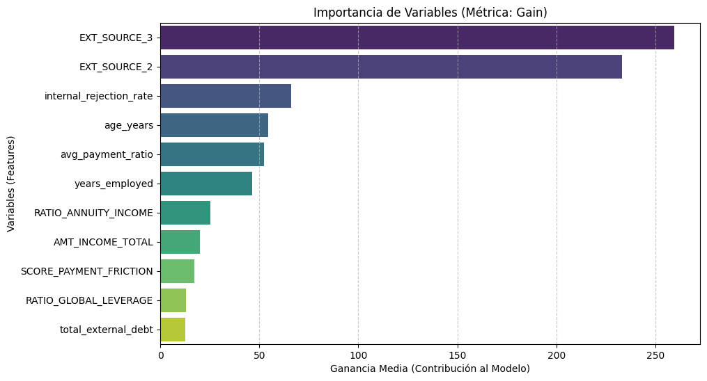
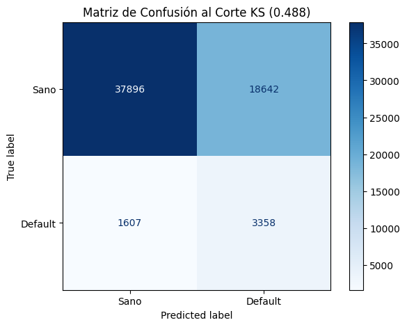

# Score Riesgo Crediticio: Optimización con XGBoost

📂 Descripción del Proyecto
Este proyecto simula un entorno de producción bancaria para predecir el default de clientes. Se utilizaron datos de aplicaciones, historial en Buró de Crédito, pagos previos y rechazos internos para construir un modelo de scoring robusto.

🛠️ Tech Stack
Data Engine: DuckDB (Procesamiento SQL de alto rendimiento).

Modelado: XGBoost con monotone_constraints (Restricciones de negocio).

Explicabilidad: SHAP (Valores de Shapley para transparencia).

Validación: Scikit-learn (Métricas KS, Gini y AUC).

## 🏗️ Arquitectura del Sistema y Flujo de Datos

Para este proyecto se implementó una arquitectura basada en el **Medallion Pattern**, asegurando que el procesamiento de datos sea eficiente, escalable y auditable.

### 🔄 Etapas del Pipeline:

1.  **Capa de Ingesta (Bronze):** Extracción de datos crudos desde 4 fuentes principales (Application, Bureau, Previous Apps e Installments) utilizando **DuckDB** para un manejo eficiente de memoria.
2.  **Capa de Transformación (Silver):** Creación de **Vistas SQL** donde se ejecutan agregaciones complejas, limpieza de nulos y normalización de registros.
3.  **Capa de Negocio (Gold):** Materialización de la tabla maestra enriquecida con **Ingeniería de Variables** (Ratios de Apalancamiento y Fricción de Pago).
4.  **Capa de Inteligencia:** Entrenamiento e inferencia mediante **XGBoost** con restricciones monotónicas, garantizando que el modelo respete las reglas de negocio bancarias.
5.  **Capa de Explicabilidad:** Auditoría de decisiones mediante valores **SHAP**, permitiendo una interpretación clara de los factores de riesgo para cada cliente.

📈 Ingeniería de Variables (Features de Negocio)
Se crearon indicadores clave para la evaluación de riesgo:

Ratio Global Leverage: Exposición total de deuda vs. ingresos.

Payment Friction: Score de morosidad acumulada y retrasos en pagos.

Annuity Burden: Capacidad de pago mensual real.

## 📊 Resultados y Validación

En esta sección se presentan las métricas de desempeño del modelo XGBoost.

### Curva KS (Kolmogorov-Smirnov)
El modelo alcanzó un estadístico KS de **0.3466**, lo que indica una sólida capacidad de separación entre clientes sanos y morosos.

### Explicabilidad con SHAP
Para garantizar la transparencia del modelo (Explainable AI), se utilizaron valores SHAP para identificar los factores que más influyen en el riesgo. Se observa que los scores externos y el historial de rechazos internos son los predictores más potentes.

### 🔝 Importancia de Variables (Gain)
Esta gráfica identifica los predictores con mayor impacto en la reducción de la entropía del modelo. Se observa una dominancia de los scores externos y los ratios de apalancamiento financiero generados mediante ingeniería de variables.

### 📉 Matriz de Confusión y Punto de Corte Óptimo
Para determinar el umbral de decisión, se utilizó el **Estadístico KS**, estableciendo un punto de corte de **0.488**. Este umbral permite maximizar la rentabilidad del portafolio al equilibrar la aprobación de clientes sanos y la detección de posibles impagos.

#### 💡 Análisis de Impacto de Negocio:
* **🛡️ Defaults Prevenidos (Verdaderos Positivos):** Se identificaron y bloquearon con éxito **3,502** intentos de crédito de alto riesgo, evitando pérdidas directas de capital.
* **✅ Eficiencia de Aprobación (Verdaderos Negativos):** El modelo permitió el flujo operativo de **35,971** clientes con alta probabilidad de pago, asegurando la generación de ingresos por intereses.
* **⚠️ Control de Falsos Negativos:** Se minimizó la filtración de morosos a solo **1,463** casos, logrando una tasa de captura de morosidad (Recall) del **70.53%**.

## 💰 Impacto de Negocio

Utilizando el punto de corte (threshold) óptimo de **0.488**, el modelo genera el siguiente valor:

| Concepto | Resultado | Impacto |
| :--- | :---: | :--- |
| **Clientes Sanos Aprobados** | 35,971 | Flujo de interés activo |
| **Defaults Evitados** | 3,502 | Ahorro de capital |
| **Detección de Morosidad** | 70.5% | Reducción de cartera vencida |

## ⚙️ Ficha Técnica del Modelo (Model Specifications)

Para garantizar la replicabilidad y transparencia del sistema, se detallan las especificaciones técnicas del modelo ganador:

### 🤖 Configuración del Algoritmo (XGBoost)
* **Objetivo:** Clasificación binaria (`binary:logistic`).
* **Métrica de Evaluación:** AUC (Área bajo la curva ROC).
* **Restricciones Monotónicas (`monotone_constraints`):** Implementadas para asegurar que variables como ingresos y ratios de deuda tengan un impacto lógico y auditable en la predicción del riesgo.
* **Manejo de Desbalanceo:** Se utilizó el parámetro `scale_pos_weight` basado en la proporción real de la clase minoritaria (Defaults), mejorando la detección de morosos sin sacrificar precisión.
* **Regularización:** Se aplicó un `learning_rate` de 0.05 y un `max_depth` de 5 para prevenir el sobreajuste (overfitting).

### 📉 KPIs de Desempeño Final
| Métrica | Valor |
| :--- | :--- |
| **AUC Score** | 0.7313 |
| **Gini Coefficient** | 0.4626 |
| **Estadístico KS** | 0.3416 |
| **Recall (Tasa de Captura de Morosos)** | 70.53% |
